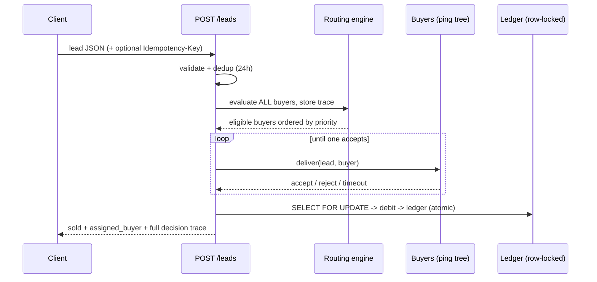

# EcomfyApp · Mini Lead Routing Engine

A small but **fully functional** lead-routing backend + dashboard. Receives leads
by API, validates them, picks the right buyer via configurable rules, runs a
**ping tree with fallback**, settles a **buyer ledger** (with anti double-charge),
handles **returns/refunds**, produces an **operational report**, raises **alerts**,
and writes an optional **AI executive summary**.

- **Backend**: FastAPI + SQLAlchemy + PostgreSQL, hexagonal architecture.
- **Frontend**: Next.js 15 (App Router) dashboard — server-rendered, no CORS.
- **AI**: a single Claude API call that only summarizes already-computed metrics.
- **Everything is traceable**: every routing decision is stored (eligible / why-not).

> Full design rationale in [docs/TECHNICAL.md](docs/TECHNICAL.md).
> Test evidence in [docs/EVIDENCE.md](docs/EVIDENCE.md).

---

## Flow (ingest → ping tree → ledger)



---

## Quick start

### Option 1 — Docker (recommended: real Postgres, full stack)
```bash
cp env.example .env            # optional: add ANTHROPIC_API_KEY / SLACK_WEBHOOK_URL
docker compose up --build
```
- API  → http://localhost:8000  (Swagger UI at `/docs`)
- Web  → http://localhost:3000

Seed and exercise it:
```bash
curl -X POST http://localhost:8000/dev/seed-leads     # ingest the 10 fixture leads
bash scripts/smoke.sh http://localhost:8000           # run the 8 scenarios
```

### Option 2 — Local, no Docker (SQLite)
The Postgres driver (`psycopg2`) is only needed for Docker/prod. Locally you can
run on SQLite:
```bash
python -m venv .venv
.venv/Scripts/python -m pip install fastapi uvicorn sqlalchemy pydantic pydantic-settings email-validator httpx anthropic
DATABASE_URL="sqlite:///./local.db" .venv/Scripts/python -m uvicorn app.main:app --port 8000
```
(omit `.Scripts` on macOS/Linux: `.venv/bin/...`)

Frontend:
```bash
cd frontend
npm install
API_BASE_URL=http://localhost:8000 npm run dev      # http://localhost:3000
```

---

## Tests
```bash
.venv/Scripts/python -m pip install pytest
.venv/Scripts/python -m pytest -q          # 25 tests (domain + integration on SQLite)
```
- `tests/test_routing.py` — eligibility rules, schedule, priority ordering
- `tests/test_ledger.py` — debit / overdraw guard / refund
- `tests/test_integration_api.py` — the 8 required scenarios end-to-end

---

## Endpoints
| Method | Path | Purpose |
|--------|------|---------|
| POST | `/leads` | Ingest + validate + route a lead (returns full trace) |
| POST | `/leads/{id}/return` | Return a sold lead, refund the buyer |
| GET  | `/reports/daily-summary` | Operational report (`?ai=true` adds AI summary) |
| GET  | `/leads` · `/leads/{id}` | List / detail (detail = evaluations + attempts + ledger) |
| GET  | `/buyers` · `/alerts` | Current buyer state / generated alerts |
| POST | `/dev/reset` · `/dev/seed-leads` | Repeatable-demo helpers |

Collections: [`requests.http`](requests.http) (VS Code REST Client) and
[`postman_collection.json`](postman_collection.json).

---

## What works vs. what is simulated
**Real**: validation, dedup (24h), routing rules + priority, ping-tree fallback,
atomic ledger (row-locked debit, anti double-charge), returns/refunds, operational
report, alerts (DB + console/Slack), full audit trail, the Next.js dashboard.

**Simulated**: buyer delivery — `app/adapters/buyers/simulated_client.py` returns
accept/reject/timeout based on each buyer's `webhook_behavior`. This is the seam
that becomes a real Phonexa/Everflow/GHL adapter in production (see TECHNICAL.md).
Timeouts are modeled as latency above the threshold (no real sleep).

---

## Deploy
- **GCP VM via CLI**: [deploy/gcp-vm.md](deploy/gcp-vm.md)
- The hexagonal core is designed to later decouple into GCP Cloud Run / Functions.

---

## Project layout
```
app/
  domain/        pure engine: routing rules + ledger math (no framework)  [unit-tested]
  application/   use cases: ingest_lead, return_lead, daily_summary, alerts
  ports/         interfaces: buyer_delivery, ai_summary, alerts
  adapters/      db (models, repos, seed), buyers (simulated), ai (claude), alerts
  api/           FastAPI routes (thin HTTP edge)
frontend/        Next.js 15 dashboard (Server Components + Server Actions)
tests/           unit + integration
seed/leads.json  10 fixture leads
scripts/smoke.sh end-to-end curl run
deploy/          GCP VM startup script + guide
```

## Security
No real data or credentials. Secrets come from env (`.env` is gitignored;
`env.example` is the template). Do not commit `.env`.
